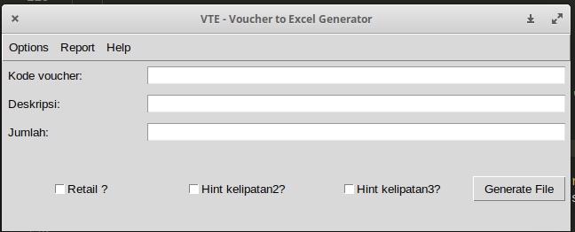

# VTE (Voucher to Excel) generator

Ini software sederhana, fungsi nya hanya untuk membantu menyelesaikan _repeated task_ yang kadang menyita banyak waktu dan konsentrasi. Kedepannya ini bisa jadi portofolio saya mungkin (?) haha

Software ini berbasis Python 3 dan untuk database nya memakai SQLite3. Sementara library GUInya saya memakai Tkinter.

Software ini sudah masuk versi 0.5

beberapa _repeated task_ yang saya maksud :
1. Tiap ingin input kode voucher gosok ke Software Server Pulsa, harus membuat file bertipe excel dengan template tertentu. Dan template nya ini disesuaikan dengan nama voucher, kode produknya, jumlah dsb. (Done versi 0.1)
2. Pada file tersebut ada isian waktu input yang terdiri dari : bulan/tanggal/tahun jam:menit:detik . Tiap kali membuat file bertipe excel ini , pada bagian detiknya harus dibuat urut sehingga kode gosok voucher yang keluar sesuai dengan urutan inputnya. (Done versi 0.1)
3. Nama File dari excel voucher harus *semantik* dalam artian mewakili voucher , jumlah dan waktu file dibuat , sehingga mudah dalam mencarinya kembali.(Done versi 0.1)
4. Software harus bisa dijalankan dalam format binnary (executable) , tak perlu masuk prompt dan menjalankan 'python namaapp.py' . (done versi 0.2)
5. Karena ada instalasi Software Server Pulsa Baru di kantor, dan menuntut format template yang berbeda. (done versi 0.3)
6. Fitur baru, 'report'. Gunanya untuk membuat 1 report file yang isinya beberapa file voucher. (done versi 0.4)
7. Fitur baru, kustom hint background tertentu. Penambahan menubar untuk tampilan yang lebih bersih. (done versi 0.5)

versi 0.1 dan versi 0.2 ada di repository lama --> [disini.](https://github.com/taufiq33/vte-generator)

Alasan saya membuat repo baru untuk software ini adalah supaya rapi dan mudah saya kembangkan lagi.

